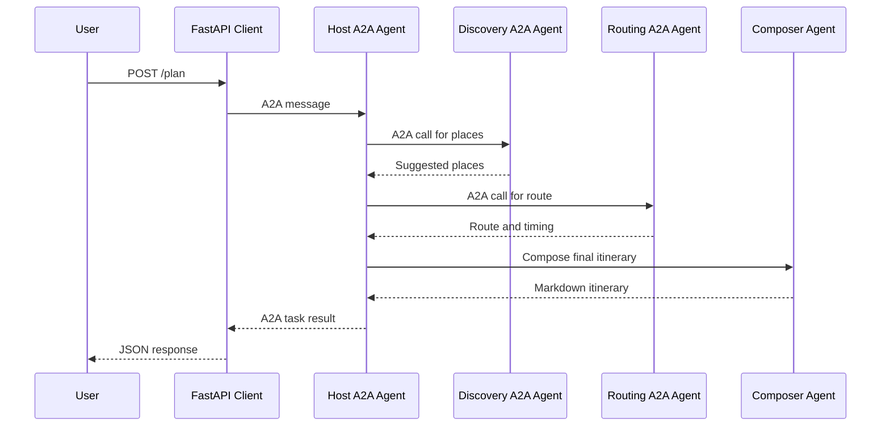

# A2A Travel Agent

## Start the services

Open separate terminals.

Start the Discovery Agent A2A server:

```bash
uvicorn discovery:application --host 0.0.0.0 --port 10020
```

Start the Routing Agent A2A server:

```bash
uvicorn routing:application --host 0.0.0.0 --port 10021
```

Start the Host Travel Agent A2A server:

```bash
uvicorn agent:application --host 0.0.0.0 --port 10022
```

Start the FastAPI client:

```bash
uvicorn main:app --host 0.0.0.0 --port 8005
```

---

Alternatively, you can start all in the same terminal, using `concurently`.

Step 1: Install `concurently`:

```bash
npm install -g concurrently
```

Step 2: run:

```bash
concurrently \
"uvicorn discovery:application --host 0.0.0.0 --port 10020" \
"uvicorn routing:application --host 0.0.0.0 --port 10021" \
"uvicorn agent:application --host 0.0.0.0 --port 10022" \
"uvicorn main:app --host 0.0.0.0 --port 8000"
```

In order to show more detailed logs, run instead:


```bash
export PYTHONWARNINGS="ignore"
export LOG_LEVEL="debug"

concurrently \
  --names "discovery,routing,agent,client" \
  --prefix "[{name}]" \
  --kill-others-on-fail \
  "uvicorn discovery:application --host 0.0.0.0 --port 10020 --log-level debug --access-log" \
  "uvicorn routing:application --host 0.0.0.0 --port 10021 --log-level debug --access-log" \
  "uvicorn agent:application --host 0.0.0.0 --port 10022 --log-level debug --access-log" \
  "uvicorn main:app --host 0.0.0.0 --port 8000 --log-level debug --access-log"
```


## Test the application

Send a request:

```bash
curl -X POST http://localhost:8005/plan \
  -H "Content-Type: application/json" \
  -d '{
    "query": "I have 4 hours in Berlin. I like museums, architecture, and good coffee. Create a walking-friendly itinerary."
  }'
```

## Runtime flow

